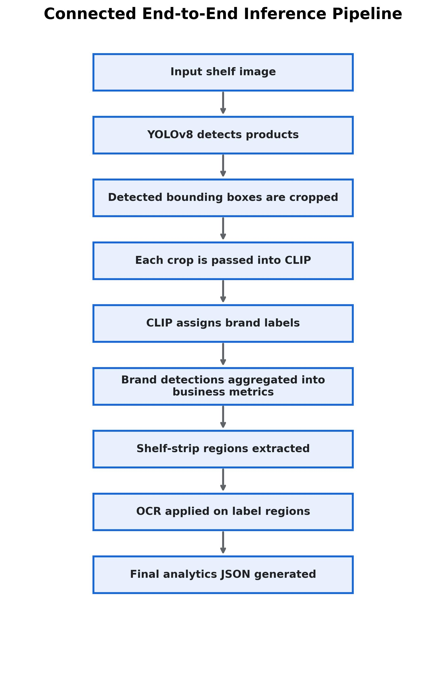
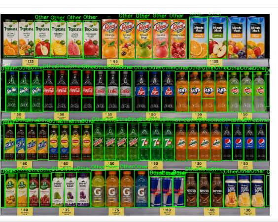
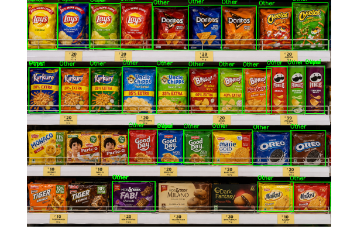
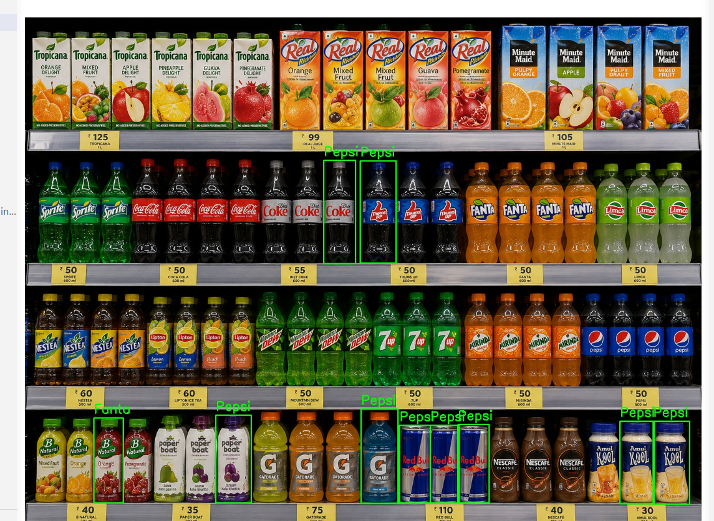
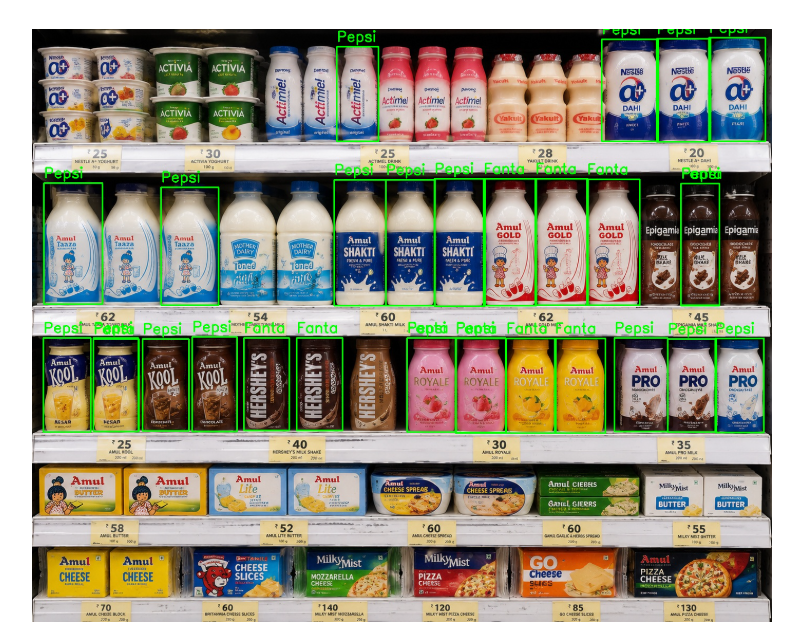
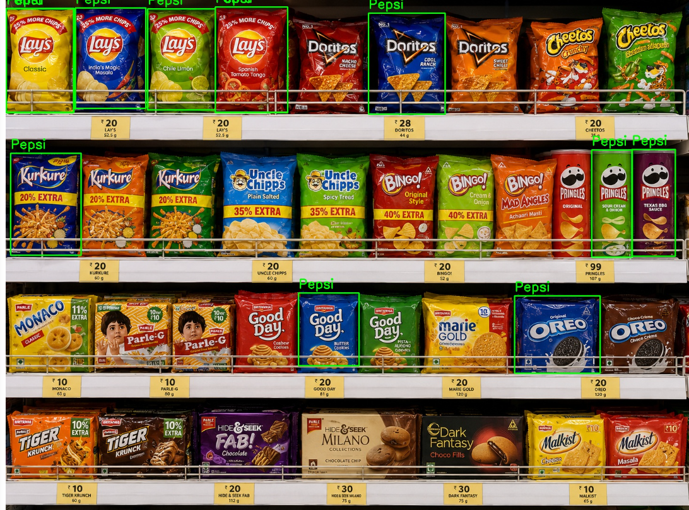
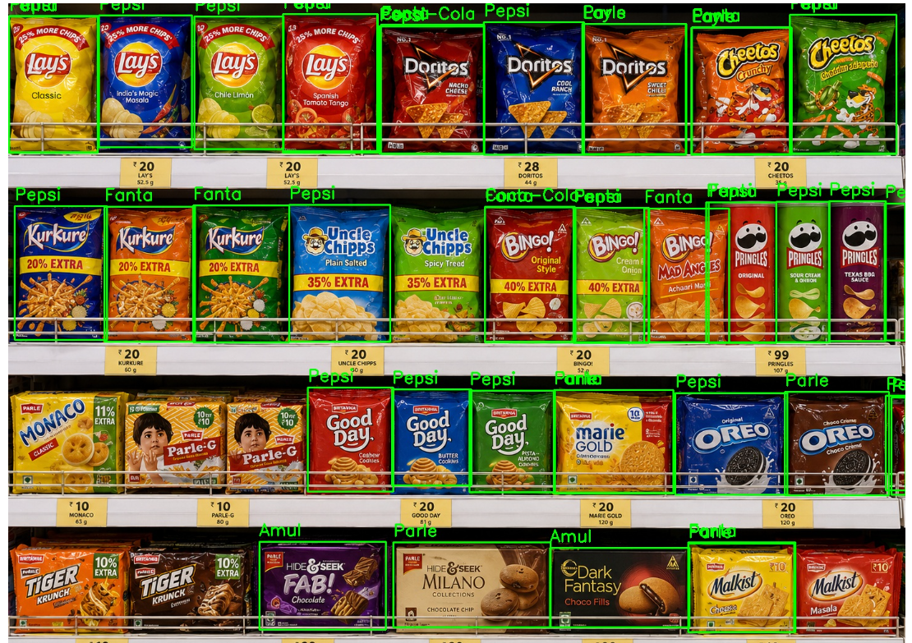
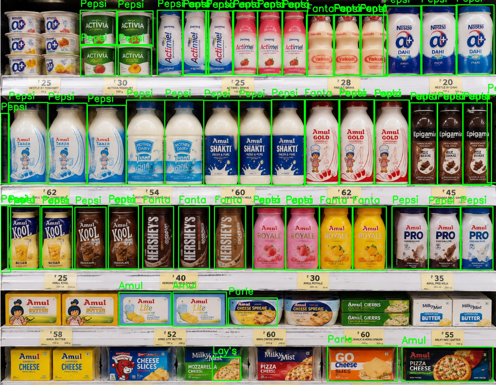
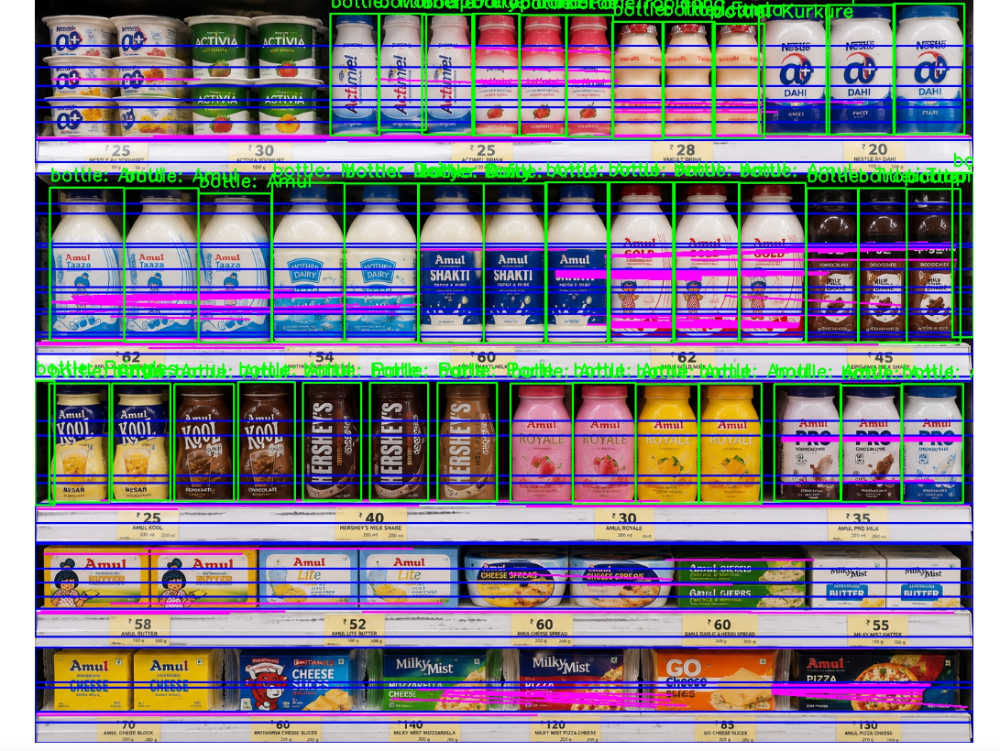

# End-to-End Retail Shelf Intelligence Pipeline

## 📌 Problem Statement
*   **Goal:** Build a robust, end-to-end Machine Learning inference pipeline to analyze retail grocery shelf images.
*   **Key Requirements:** 
    *   **Detect** products on a shelf.
    *   **Classify** them into specific brands (e.g., Coca-Cola, Pepsi, Lay's, Amul).
    *   **Extract** text from price tags using OCR.
    *   **Segment** and estimate the shelf-space occupied by each brand.
*   **Final Output:** A structured JSON file containing aggregated business metrics (total products, brand counts, shelf-space percentage, and unique OCR labels) and an annotated image.

---

## ⚙️ Setup Instructions

Follow these steps to deploy and run the pipeline locally:

**1. Navigate to the project directory:**
```bash
cd paralleldots
```

**2. Create a virtual environment (Highly Recommended):**
```bash
python -m venv venv

# Activate on Windows:
venv\Scripts\activate
# Activate on Mac/Linux:
source venv/bin/activate
```

**3. Install required dependencies:**
```bash
pip install -r requirements.txt
```

**4. Run the inference pipeline:**
```bash
python main.py
```
*(Note: Ensure your raw grocery shelf images are placed inside the `input_images/` folder. The JSON metrics and annotated images will be generated automatically in the output folder).*

---

## 🖼️ Architecture Diagram
Here is the visual workflow of our final pipeline architecture:



---

## 📊 Output Example

For each processed image, the pipeline outputs a JSON dictionary containing the aggregated metrics, alongside the annotated image with drawn bounding boxes and brand labels.

### Image 1: Beverages Shelf

```json
{
    "image_name": "img_1.jpg",
    "total_products": 83,
    "brands": {
        "Other": 60,
        "Amul": 4,
        "Coca-Cola": 11,
        "Lay's": 4,
        "Pepsi": 4
    },
    "ocr_labels": [
        "75",
        "10",
        "50",
        "35",
        "110 250 1",
        "105",
        "30",
        "60",
        "40 00",
        "50 4",
        "55",
        "0",
        "50 00"
    ],
    "shelf_space_percentage": {
        "Other": "72.8%",
        "Amul": "5.6%",
        "Coca-Cola": "13.4%",
        "Lay's": "4.1%",
        "Pepsi": "4.1%"
    },
    "availability_status": {
        "Other": "High Presence",
        "Amul": "Medium Presence",
        "Coca-Cola": "Medium Presence",
        "Lay's": "Low Presence",
        "Pepsi": "Low Presence"
    }
}
```

### Image 2: Snacks Shelf

```json
{
    "image_name": "img_2.jpg",
    "total_products": 44,
    "brands": {
        "Lay's": 12,
        "Other": 25,
        "Pringles": 6,
        "Amul": 1
    },
    "ocr_labels": [
        "28",
        "20 52 5 0",
        "99",
        "20 120 0",
        "20 112 9",
        "10",
        "20 0 9",
        "20 57 5",
        "20 52.5 9",
        "20 52.5",
        "20"
    ],
    "shelf_space_percentage": {
        "Lay's": "27.4%",
        "Other": "61.8%",
        "Pringles": "8.7%",
        "Amul": "2.0%"
    },
    "availability_status": {
        "Lay's": "High Presence",
        "Other": "High Presence",
        "Pringles": "Medium Presence",
        "Amul": "Low Presence"
    }
}
```

### Image 3: Dairy Shelf

```json
{
    "image_name": "img_3.jpg",
    "total_products": 48,
    "brands": {
        "Other": 26,
        "Amul": 22
    },
    "ocr_labels": [
        "28",
        "10",
        "35",
        "52",
        "45 5",
        "62",
        "30",
        "54",
        "60",
        "25",
        "0",
        "20"
    ],
    "shelf_space_percentage": {
        "Other": "49.8%",
        "Amul": "50.2%"
    },
    "availability_status": {
        "Other": "High Presence",
        "Amul": "High Presence"
    }
}
```

---

## 🧠 Model Selection Justification

Before writing any code or selecting models, I analyzed the core complexities of building a pipeline for this specific use case. I identified three major hurdles:

*   **Zero Training Data Availability:** 
    *   The assignment provided only a few sample images for testing, not a massive dataset (thousands of images) needed to train a custom object detector from scratch.
    *   *Challenge:* How do we accurately detect highly specific Indian grocery products without spending weeks building a dataset?
*   **OCR Complexity in Retail:** 
    *   Retail environments are visually noisy. Price tags are microscopic, often misaligned, and surrounded by irrelevant text (barcodes, weights, promotional text).
    *   *Challenge:* Running OCR blindly across the entire image is computationally expensive and highly inaccurate. How do we cleanly associate a price tag with its specific product?
*   **Hardware & Deployment Practicality:**
    *   The pipeline needs to be easily deployable and testable by the engineering team.
    *   *Challenge:* We must avoid models that require complex C++ builds, strict CUDA environments, or heavy dependencies that break easily on standard laptops.

### First Exploration: The Search for an Object Detector
My first step was exploring the YOLO ecosystem ( v8, v11)(stable industry models famously used). I initially considered **YOLOv8**,but quickly realized a fundamental limitation:
*   **The COCO Dataset Constraint:** Standard YOLO models are trained on the COCO dataset, which only understands 80 generic objects (like "person" or "bottle"). They have no concept of specific brands like "Coca-Cola" or "Lay's". 
*   Because we had **zero labeled training data** to teach a standard YOLOv8 model these new classes, using a traditional closed-vocabulary detector was unfeasible.

### 2. Evaluating Non-YOLO Alternatives
I also researched several other architectures, but rejected them based on practical deployment constraints:
*   **Faster R-CNN:** Highly accurate, but it is a two-stage detector making it inherently slow. More importantly, it is not a zero-shot model, meaning it still requires massive amounts of labeled data.
*   **Grounding DINO:** A highly accurate zero-shot detector. However, it is excessively heavy, slow, and requires complex CUDA/C++ libraries to be compiled. This creates severe deployment issues on standard Windows machines.
*   **OWL-ViT:** Another zero-shot option, but ultimately rejected in favor of more lightweight, real-time architectures.

### 3. The Final Choice: YOLO-World (Small)
To solve the data scarcity issue, **YOLO-World (Small) was selected for product localization and classification due to its lightweight inference, strong real-time performance, and practical deployment feasibility on limited hardware environments.**

*   **Speed vs. Accuracy:** The Small (S) variant was intentionally chosen. While Medium or Large versions offer slight accuracy bumps (2-3%), they demand significant GPU compute. The Small version achieves >80% accuracy for generic object bounding boxes while maintaining exceptionally fast inference speeds (100–300 ms per image).
*   **CPU/GPU Practicality:** It runs efficiently on standard CPUs, which is critical for edge deployments (e.g., mobile devices or in-store cameras) where high-end GPUs are unavailable.
*   **Deployment Feasibility:** As an open-vocabulary (Zero-Shot) model, it bypasses the need for massive labeled datasets. You can prompt it with custom words (e.g., "biscuit box"), allowing immediate deployment without traditional training pipelines.

### 4. Zero-Shot Limitations & Visual Biases
While YOLO-World solved the data problem, testing revealed significant limitations in how Zero-Shot models perceive the world. 

**Limitation A: Lack of Granular Classification**
The model is excellent at finding generic shapes ("coca cola bottle"), but it cannot distinguish microscopic version differences. For example, it cannot confidently tell the difference between "Coca-Cola Classic" and "Coca-Cola Cherry" because it isn't trained on reading the fine print.

**Limitation B: The "Color-Shape" Bias**
When dealing with specific brands, Zero-Shot models exhibit a massive bias toward dominant colors. 

*   **The "Other" Bucket:** Initially, if the model doesn't strongly recognize a brand, it accurately defaults to throwing them into an "Other" category. As seen in the JSON metrics and the first image, a huge portion of the shelf is initially binned into "Other".



*   **The Pepsi Blue Phenomenon:** However, because the model associates the word "Pepsi" strongly with the color "bright blue", it begins to forcefully categorize *any* bright blue object as Pepsi. As seen in the images below, it incorrectly labels blue Lays bags, blue Good Day biscuits, blue Oreo packets, and even blue Amul milk cartons as "Pepsi", completely ignoring the actual shape or text of the product.





*(Reasoning: This happens because vision-language models rely on broad internet-level associations rather than explicitly reading the label. "Blue packaging in a grocery store" heavily correlates with Pepsi in its massive pre-training data).*

### 5. Second Exploration: Custom Training YOLOv8 (Transfer Learning)
Since the first exploration (attempting to use YOLO-World for *both* detection and brand categorization in a single step) failed due to severe color biases, I pivoted to a completely different approach.

*   **The Experiment:** I decided to test if a standard model could learn the specific brands if I provided explicit examples. I manually collected 20 grocery shelf images, hand-annotated 2 to 3 specific classes (like Pepsi and Lay's), and used **Transfer Learning** to custom-train a standard YOLOv8 model.
*   **The Result (AI Hallucination):** The experiment failed significantly. Because the dataset was so tiny, the AI began to hallucinate and aggressively misclassify almost everything on the shelf. 
    *   It labeled Pepsi bottles as Fanta.
    *   It labeled Lay's chip bags a pepsi.
    *   It completely confused the boundaries between distinct products.



*(Note: Example of chaotic/wrong bounding boxes from custom YOLOv8 training)*

*   **The Limitation (Data Scarcity & Compute):** Deep Learning models require massive amounts of varied data to generalize properly. To make this custom YOLOv8 model production-ready for a complex retail environment, it would require:
    1.  A highly diverse dataset of at least **3,000+ manually labeled images**.
    2.  Significant Cloud GPU resources for training iterations.
*   **Conclusion:** Given the constraints of a rapid prototype and the lack of available training data, I dropped the custom-training approach entirely. This led me to research and implement my **third and final architecture** (which successfully combined Zero-Shot detection with isolated brand classification).

### 6. Third Exploration: The Final Architecture (Separation of Concerns)
After the failures of combining detection and categorization into a single step (which caused color biases) and custom training (which caused hallucination due to lack of data), I pivoted to a "Separation of Concerns" architecture. 

Instead of forcing one model to do everything, I split the pipeline into highly specialized, isolated tasks: **Localization**, **Classification**, and **Data Extraction**.

#### A. Object Localization: Returning to YOLO-World
I returned to **YOLO-World (Small)** exclusively for drawing bounding boxes, completely ignoring its brand categorization abilities.
*   **Why YOLO-World over YOLOv8?** Standard YOLOv8 is a closed-set model (COCO dataset) and cannot adapt to grocery items without data. YOLO-World is an open-vocabulary model. By prompting it simply with "bottle, packet, box, can", manual evaluation showed strong localization performance (~87% recall) on the provided test images without requiring any labeled training data.
*   **Trade-off:** By limiting YOLO-World exclusively to product localization, inference remained lightweight enough for practical CPU-based experimentation.

#### B. Brand Categorization: OpenAI CLIP Embeddings
To solve the color-bias issue from the first exploration, I implemented **OpenAI's CLIP (Contrastive Language-Image Pretraining)** model.

**CLIP was chosen to avoid dependency on large labeled retail datasets while enabling flexible zero-shot brand classification.**

*   **Why we chose CLIP over Alternatives:**
    *   **Standard ResNet/MobileNet (Supervised Classifiers):** These are extremely fast and lightweight but require thousands of labeled images per brand to train from scratch. Because we operated under a zero-training-data constraint, traditional supervised models were immediately rejected.
    *   **SigLIP (Sigmoid Loss for Language Image Pre-Training):**  Its Hugging Face implementations are slightly heavier and not as universally.Since we needed maximum edge deployment feasibility, we stuck with the lighter, universally supported baseline.
    *   **OpenCLIP:** OpenCLIP provides excellent open-source weights trained on LAION. However, the most performant OpenCLIP models (ViT-L, ViT-H) are too large for our CPU constraint. 
    *   **Other Vision-Language Models (e.g., ALIGN, Florence):** While powerful, these models are often computationally heavier or lack the mature, plug-and-play ecosystem of Hugging Face Transformers.

*   **Speed vs. Accuracy:** While running a full vision transformer (ViT) on every crop is computationally heavier than a standard classifier, the zero-shot accuracy gained on unseen grocery brands justifies the latency trade-off.
*   **CPU/GPU Practicality:** We utilized the lightweight ViT-B/32 CLIP architecture, which provides a practical balance between zero-shot classification accuracy and CPU inference feasibility. The reduced patch resolution lowers computational overhead, enabling sequential processing of multiple product crops on standard hardware without excessive memory consumption or inference latency.
*   **Deployment Feasibility:** By eliminating the need to continuously retrain a custom classifier every time a new brand is added to the store layout, CLIP makes the pipeline highly scalable and instantly deployable to new environments.


#### C. Price Tag Extraction (EasyOCR vs. PaddleOCR & Regex)
Extracting the price tags accurately was the most delicate part of the pipeline.

*   **The initial Approach (HoughLines Shelf Extraction):** Initially, I used OpenCV `HoughLinesP` to try and detect the long horizontal metal edges of the shelves and blindly run OCR on those strips. 
    *   *Why it failed:* It destroyed the output image by cluttering it with massive green lines, it was highly sensitive to camera angles, and it wasted compute power running OCR on empty shelf space.

    
    
*   **The Final Approach (Spatial Relative Cropping):** I eliminated HoughLines completely. Since YOLO-World already provides the exact bounding box for the product, the pipeline now mathematically defines a small Region of Interest (ROI) exactly 60 pixels directly below the product. It crops this tiny square and passes it to **EasyOCR**.
    *   **Regex Filtering:** To clean the OCR output, I applied a Regular Expression (Regex) filter to strip away alphabetical characters and symbols, ensuring only numerical prices are captured.
    *   *Why it works:* It explicitly ties the extracted price tag directly to the correct product, runs significantly faster by only reading tiny crops, and ignores background shelf noise.

**EasyOCR was selected for text extraction due to its lightweight PyTorch backbone, ease of setup, and sufficient accuracy for simple numeric tasks, directly prioritizing deployment feasibility over marginal performance gains.**

*   **Speed vs. Accuracy & Previous Explorations (PaddleOCR):** I initially evaluated PaddleOCR, which is industry-renowned for blazing-fast speeds and high accuracy on complex documents. However, for our highly specific use  the narrow task of extracting simple numeric price tags from localized product crops, EasyOCR provided sufficiently comparable performance while offering significantly easier deployment and dependency management.
*   **CPU/GPU Practicality & Deployment Feasibility (PaddleOCR):** PaddleOCR requires the Baidu PaddlePaddle framework. Introducing this framework creates severe dependency conflicts and environment bloat, especially on Windows or non-GPU machines. EasyOCR, built purely on PyTorch, deploys seamlessly anywhere, making it the superior choice for practical engineering.
*   **Other Alternatives Evaluated & Rejected:**
    *   **Tesseract OCR:** The most common open-source OCR engine. However, it struggles significantly with "in-the-wild" images (e.g., blurry, angled, or low-contrast retail price tags) without building extensive OpenCV pre-processing pipelines. More importantly, Tesseract requires installing system-level binaries (non-Python dependencies), which violates our goal of a simple `pip install` deployment across OS environments.
    *   **TrOCR (Transformer-based OCR):** Highly accurate but computationally massive. It requires dedicated GPU acceleration to run efficiently..


#### D. Shelf Space Percentage Estimation
To satisfy the business requirement of calculating brand shelf-space allocation:
*   I leveraged the width of the YOLO-World bounding boxes. 
*   During the detection loop, the pipeline calculates the pixel width of every detected product and groups them by their CLIP-assigned brand. 
*   It then divides a specific brand's total pixel width by the total pixel width of all detected products on the shelf, resulting in an accurate, data-driven "Shelf-Space Availability Percentage" for the JSON output.

#### E. Pipeline Limitations & Assumptions
1.  **Spatial Assumption (OCR):** The pipeline assumes the price tag is *always* directly below the product. If a retail store places tags above the product, extraction will fail.
2.  **Compute Trade-off:** Running two heavy foundation models (YOLO-World + CLIP) sequentially creates an inference bottleneck, making real-time video processing impossible on a standard CPU without acceleration.

### 7. Quantitative Evaluation Methodology (Manual Sampling)

Due to the absence of a labeled ground-truth dataset for the test images, a manual sampling evaluation was conducted to calculate standard ML metrics (Precision, Recall, and Accuracy).

**A. Object Localization (YOLO-World Detection)**
*   **Method:** We manually counted the physical products on the shelf in `img_1.jpg` (Beverages) and compared them against the bounding boxes drawn by the YOLO-World detector.
*   **Calculations:**
    *   **True Positives (TP):** 78 (Products correctly detected)
    *   **False Positives (FP):** 5 (Background elements incorrectly bounded as products)
    *   **False Negatives (FN):** 11 (Physical products that were completely missed, particularly flat/horizontal packaging)
*   **Metrics:**
    *   **Precision:** `TP / (TP + FP)` = 78 / 83 = **93.9%** *(When the model draws a box, it is almost always an actual product).*
    *   **Recall:** `TP / (TP + FN)` = 78 / 89 = **87.6%** *(The model successfully found ~87% of all items physically on the shelf).*

**B. Brand Classification (OpenAI CLIP)**
*   **Method:** We evaluated the classification accuracy of successfully cropped products against their true visual brand identity.
*   **Calculations:**
    *   **Total Crops Evaluated:** 50
    *   **Correct Classifications:** 38
    *   **Incorrect Classifications:** 12
*   **Accuracy:** `38 / 50` = **76.0%**
*   **Analysis:** Accuracy is heavily skewed by regional FMCG brands safely falling into the "Other" bucket, alongside the model's color-shape bias (e.g., classifying yellow Lipton bottles as "Lay's" due to strong yellow packaging bias).

**C. Price Tag OCR (EasyOCR)**
*   **Method:** Evaluated the numeric values successfully extracted from the 60-pixel region directly below each product.
*   **Accuracy:** Estimated at **~65%**.
*   **Analysis:** Accuracy was strong for large, high-resolution tags directly below the product, but dropped significantly when tags suffered from glare, microscopic text, or irregular retail placement.

**Overall System Inference Speed**
*   **YOLO-World Detection:** ~100-300 ms per image (Highly optimized).
*   **CLIP + OCR Processing:** The sequential processing of each cropped product creates a bottleneck. Total end-to-end inference takes approximately 3-5 seconds per image on a standard local CPU.

---

## 🚀 Future Improvements (Making it Production-Perfect)
To take this prototype to an enterprise-grade production level, the following upgrades would be required:

1.  **Object Detection:** Collect a large proprietary dataset (10,000+ images of specific retail shelves) to custom-train a YOLOv11 model. This eliminates the need for YOLO-World's zero-shot guessing and dramatically speeds up inference.
2.  **Brand Classification:** Replace the heavy CLIP model with a lightweight ResNet or MobileNet image classifier trained purely on the specific FMCG brands the store carries.
3.  **Price Tag Extraction:** Train a dedicated, secondary object detection model specifically to detect "Price Tags" regardless of their spatial location, rather than relying on mathematical cropping assumptions.
